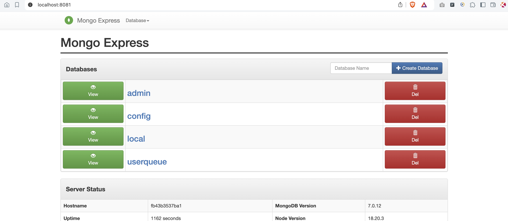
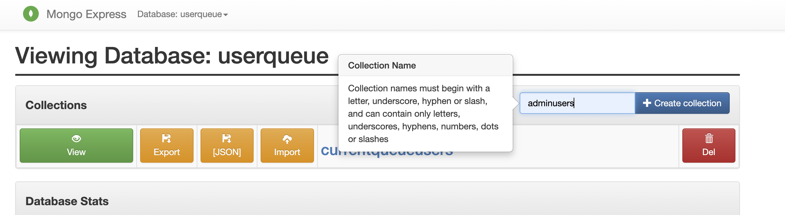
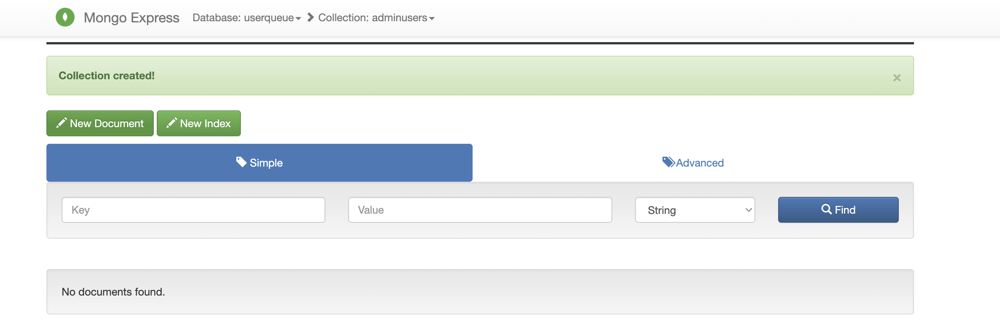
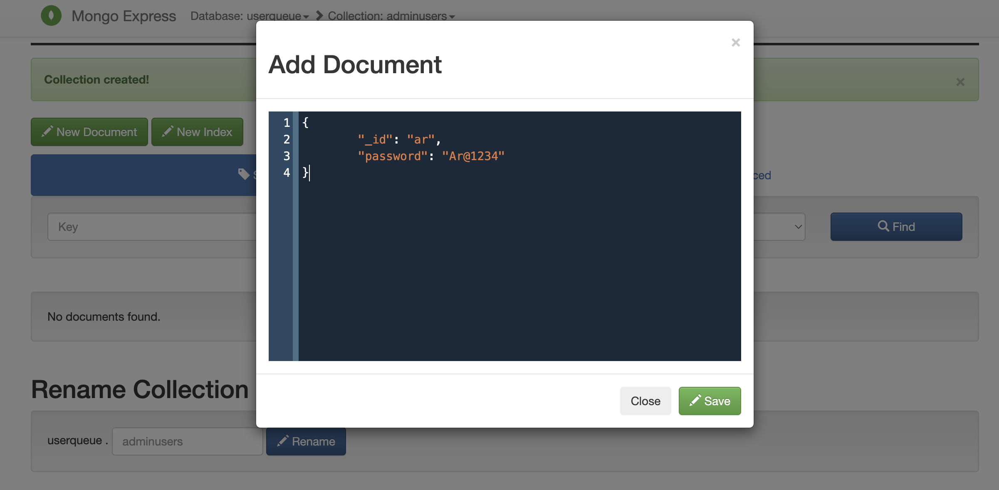

## Adding admin users for urgent deployments:

Step 1: Access mongodb using mongo-express on browser and add new collections adminusers(collection name should be this only for adding admin users):

Access mongo-express using http://localhost:8081/

Got to userqueue database.

Add new collection **adminusers**:

Step 2: Add users in the collection adminusers:

click on new documents and add the new credentials in below format:

{
        "_id": "ar",
    	"password": "Ar@1234"
}

Click on save.

Now, this credentials can be used for validating as admin. Add more admin users if required.

