## Environment management (Web-App)

### A web app to manage your deployments(multiple services) in very easy way. One place to know whoever is deploying, whoever is testing, whoever is waiting in the queue for deployments.

Please see the issues to know why this web-app is developed and which problem it solves [Problems](#issues).

Tools used:  

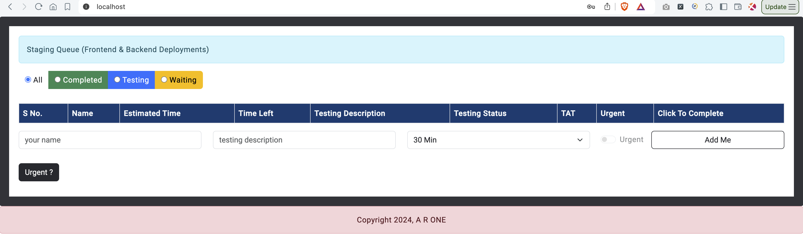

#### Add a user:
Enter name, description(why you require server), expected time and click add me:
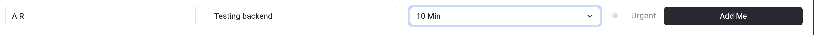

Because no one was testing queue is assigned to you.
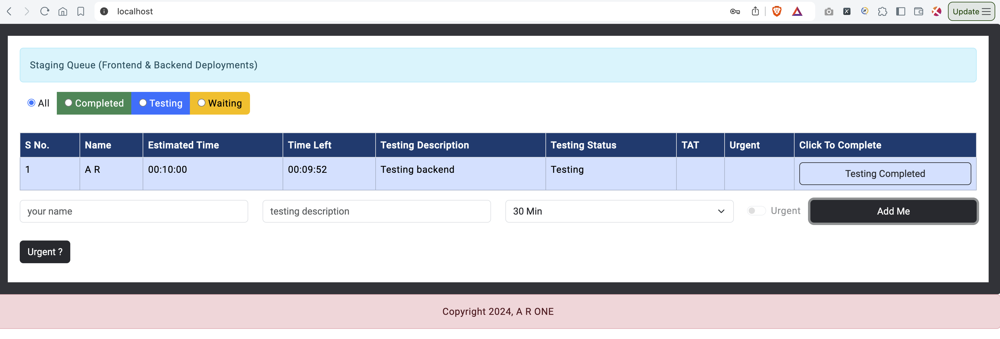

#### What if another people added?
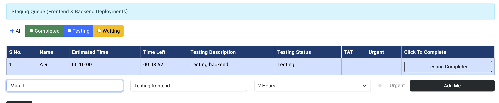

He/she will be waiting in queue unless the first one is not completed the testing on server.

#### And so on
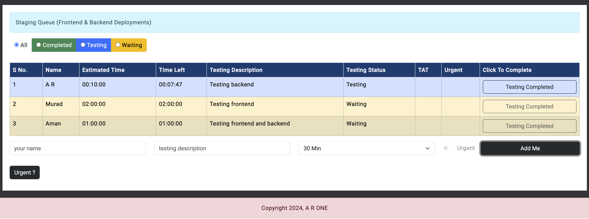

#### If any person completed the testing, queue will be assigned to next user(Once user completed his testing he/she can click testing completed button).
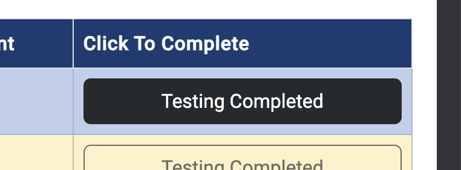

Queue will be assigned to next user(here, Murad)
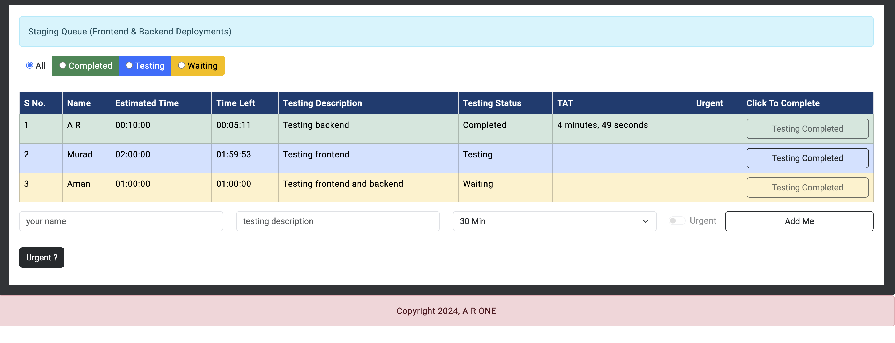

#### But what if some urgent testing is required? Well, then you can choose urgent option. For that admin access will be required, admin can be set up in database by the person hosting it on the server(Please see Adding-Admin-Users.md file).

###### Enter the details for the urgent testing.
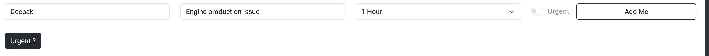
But urgent checkbox is disabled, you see urgent button below right? Click and validate ad admin by entering admin credentials:
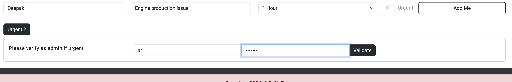

If the credentials are correct, checkbox should be enabled!
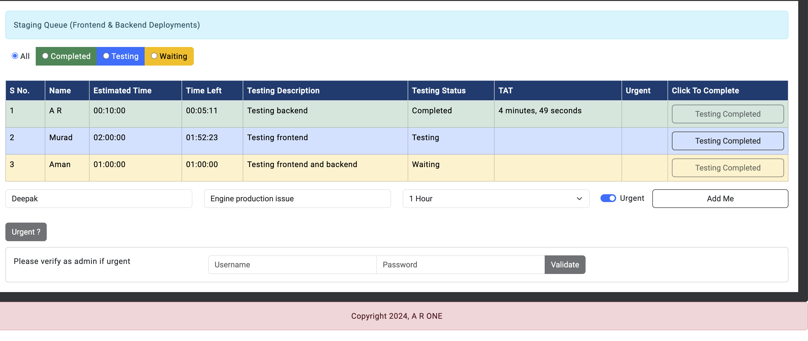

###### Now because it is a production issue and urgent testing required, once you click add current user(Murad) will be freezed and queue will be assigned to urgent user!
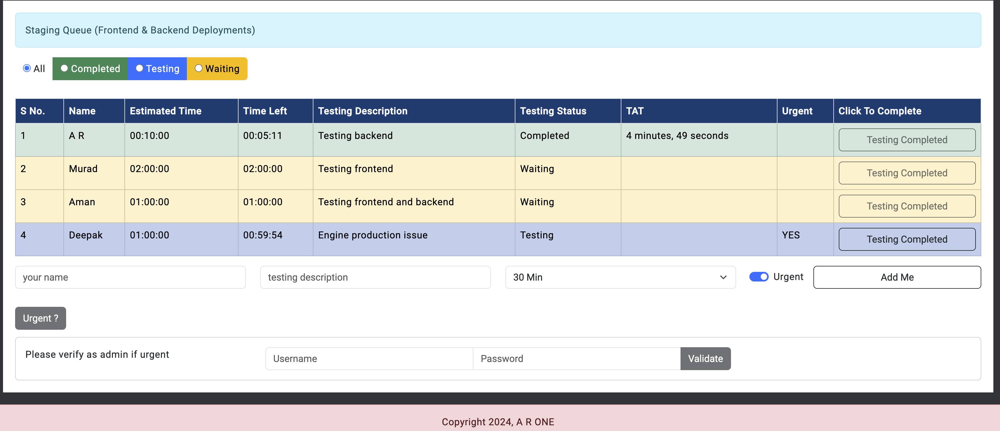

Once the production issue will be resolve and mark as testing completed, queue will follow the same order, it will be assigned back to Murad and then Aman unless if urgent testing comes in between again.
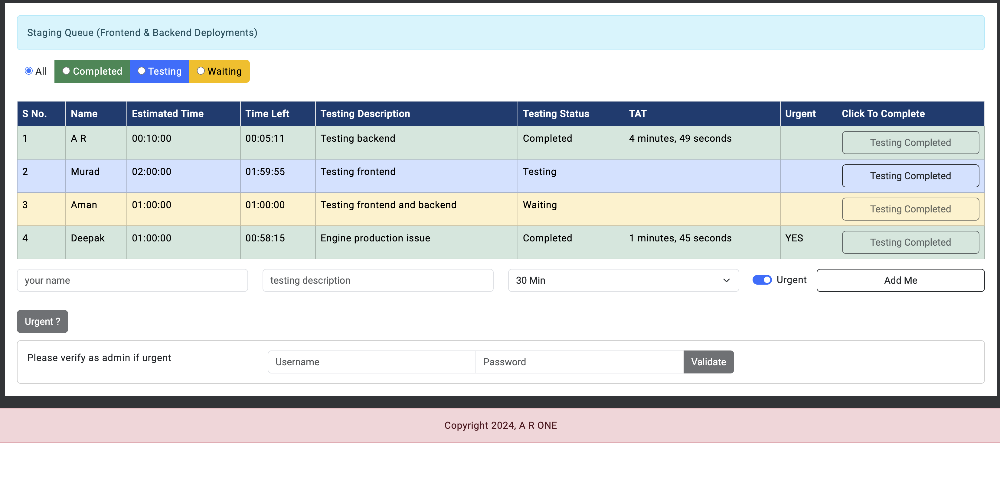

#### If large no of users are added in queue it will not be good to scroll or go through pages to check who is testing, so you can use filter options:

Completed will show the user who have completed the testing:
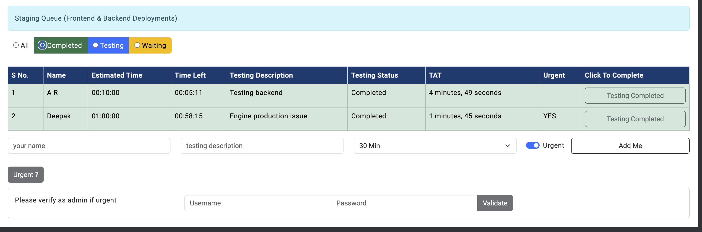

Testing will always show a single user who is currently testing:
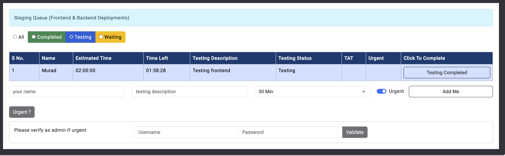

Waiting will show the user who are waiting for deployment and testing:
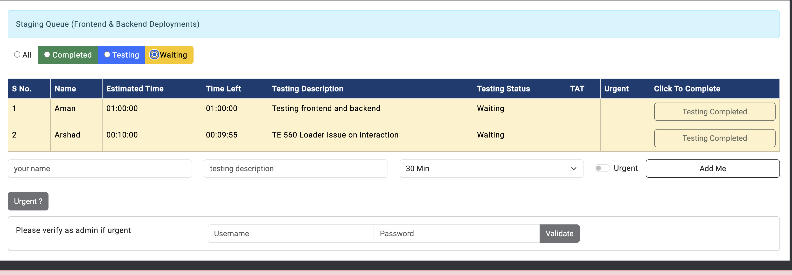

##### Please note, at one time, only 1 urgent testing is possible!

### Issues

After working in few companies, I see this challenge everywhere. Whenever we have to deploy over the server(talking about dev but can be used for UAT/production as well) we have to ask our colleagues and lots of senior persons that if someone is deploying and testing currently on the server. Same things is managed most of the times with groups over teams/whatsapp/meet. It works well when we have very few developers who requires testing in a day but managing goes out of hand when the number of developers who wants to deploy and test increases.

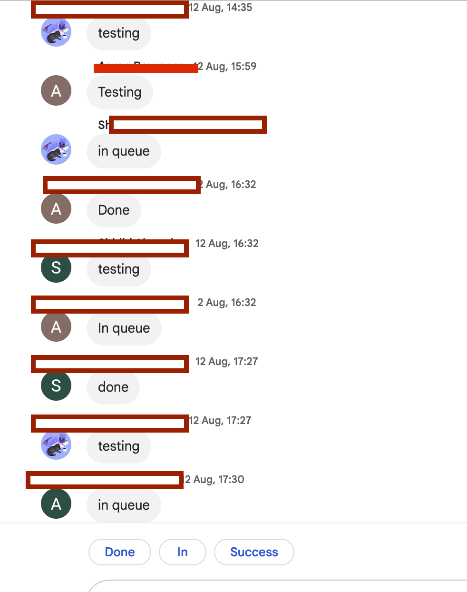

 

As we can see from the above group messages that even with few team members(10-20) it is very hard to scroll thorugh all the messages and know whoever will test next and whoever is testing. This issue not in single place but in most of the place and as a developer these things are very irritating to go throgh and find who was testing by focusing on each single messages of the group and really hard to manage for how many turns I'll get the queue.

This web-app solves this problem. Now developers who wants to deploy can see in 1 click whether the deployment queue is available or after whom I can test. They can also see who completed their testing after deployments and who is testing currently and who all are waiting in the queue in 1 click only.

#### Because it resolves the developer issues, I've made is open source for you guys.
#### To use this web-app in your system, please open Run-App.md

[Run App In My System](Run-App.md)

#### Please keep an eye on docker images for frontend and backend services of this app.

[Frontend-docker hub](https://hub.docker.com/repository/docker/helloardanish/environment-management-frontend/general)
--
[Backend-docker hub](https://hub.docker.com/repository/docker/helloardanish/environment-management-backend/general)

#### Suggestions are always welcome to make this more better and useful for the future deployments managements. Please raise the issue.

## Happy Coding,
### A R