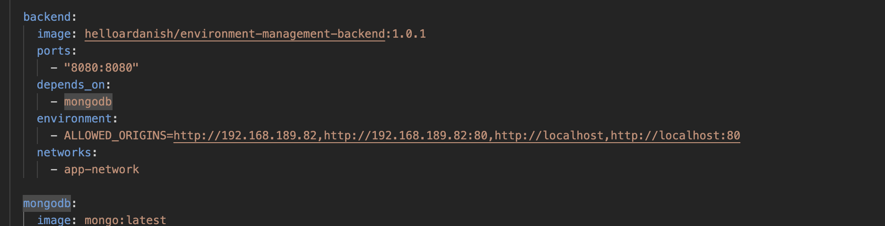
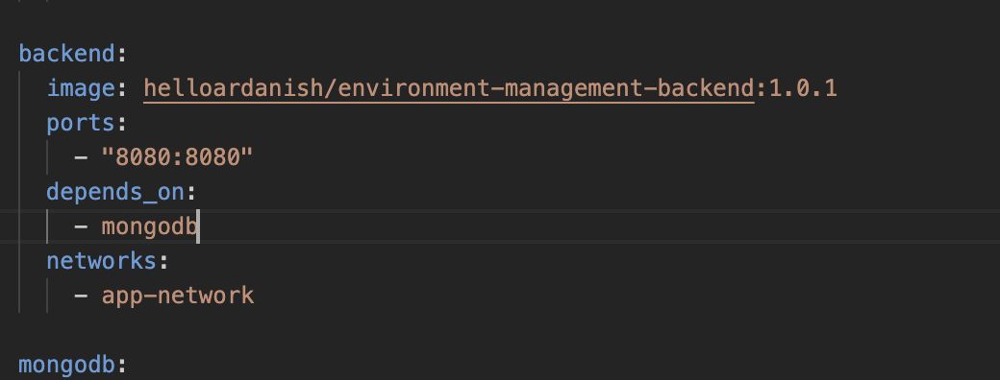

To run this app in your local machine or over LAN or over WAN please follow the below steps:

Please note docker latest(recommended) or version which support compose v2 must be installed in the system before following below steps:

Step 1: Clone the repo in your local machine (you can only download the compose.yaml as well as it is the only file which will be used to run the web-app on local/server).

Step 2: Open terminal and go to path where it is cloned.

Step 3: Provide the ip address of server (for LAN ip address of system) where frontend is hosted to allow access over localhost(default) or LAN/WAN network!

192.168.189.82 is my local ip so API call will not be blocked when accessed using LAN/WAN network where frontend is hosted.(If you don't know CORS origin policy just change it to you local ip and don't mind)

- ALLOWED_ORIGINS=http://192.168.189.82,http://192.168.189.82:80,http://localhost,http://localhost:80

If you don't provide the ip like I don't even given this parameter in environment variable or just give:

- ALLOWED_ORIGINS=http://localhost,http://localhost:80

It will only be accessed from your local machine using localhost but not over network. Which can used for yourself testing something but it's build to manage over LAN or WAN.

Step 4: Run docker command:

To make service available:
docker compose up

To take service down:
docker compose down

To use more command:
[Comand](command.md)

Enjoy!!!

Happy coding,
A R
