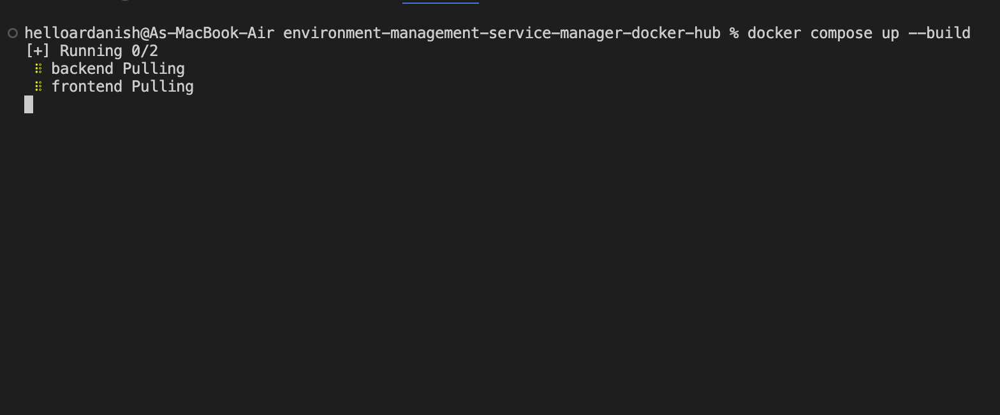
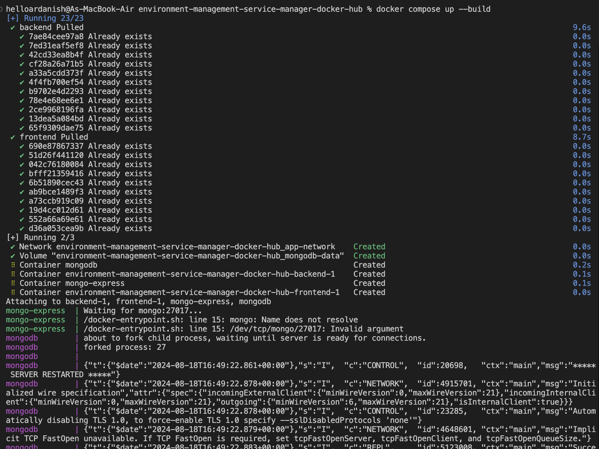
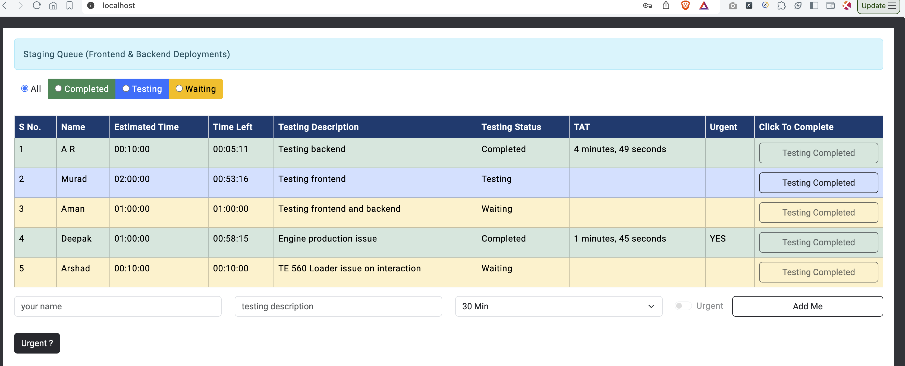

### Building after taking from docker

First time running:

docker compose up

It is running on local now.

To start:
docker compose up

To stop:
ctrl + c

To start in detached mode:
docker-compose up -d

To stop:
docker compose down

(For cache issue during build you can also use docker compose up --build)

To view logs:
docker compose logs

To view logs of specific container:
docker compose logs backend

Follow logs in real time:
docker compose logs -f

Follow logs in real time of a service:
docker compose logs -f backend

Take access of mongodb-express:
http://localhost:8081/
